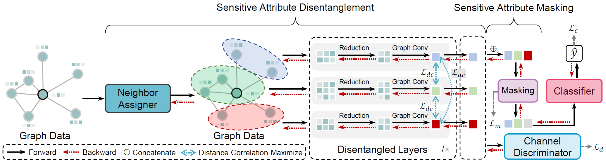

# FairSAD
A PyTorch implementation of "[Fair Graph Representation Learning via Sensitive Attribute Disentanglement](https://dl.acm.org/doi/10.1145/3589334.3645532)"

## Overview
FairSAD is a disentangled-based method to improve the fairness of GNNs while preserving task-related information. **The core idea behind FairSAD is to minimize the impact of the sensitive attribute on final predictions**.



## Requirements
- numpy==1.21.6
- torch==1.13.1
- torch-cluster==1.5.9
- torch_geometric==2.3.1
- torch-scatter==2.1.1
- torch-sparse==0.6.17
- CUDA 11.7

## Datasets download
To download datasets, please refer to these two repositories ([NIFTY](https://github.com/chirag126/nifty) and [FairGNN](https://github.com/EnyanDai/FairGNN)).

## Reproduction
To reproduce our results, please run:
```shell
bash run.sh
```

## Citation
If you find it useful, please cite our paper. Thank you!
```shell
@inproceedings{10.1145/3589334.3645532,
                author = {Zhu, Yuchang and Li, Jintang and Zheng, Zibin and Chen, Liang},
                title = {Fair Graph Representation Learning via Sensitive Attribute Disentanglement},
                publisher = {Association for Computing Machinery},
                address = {New York, NY, USA},
                url = {https://doi.org/10.1145/3589334.3645532},
                doi = {10.1145/3589334.3645532},
                booktitle = {Proceedings of the ACM on Web Conference 2024},
                pages = {1182–1192}
}
```